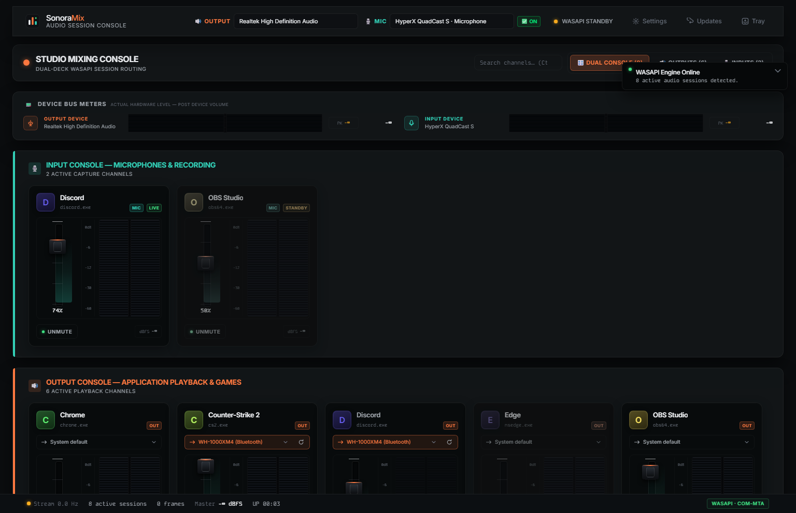

# 🎛️ SonoraMix — Professional Windows WASAPI Audio Session Console

[](https://github.com/jaimitus/SonoraMix/releases/tag/v1.0.2)
[](LICENSE)
[](https://github.com/jaimitus/SonoraMix)
[](https://github.com/jaimitus/SonoraMix)
[](https://tauri.app)
[](https://github.com/jaimitus/SonoraMix/releases)

**SonoraMix** is a high-performance, studio-grade virtual audio mixing console built natively for Windows 10 and 11. Powered by a low-overhead Rust engine using native WASAPI session APIs, SonoraMix provides real-time per-application volume control, post-fader PPM peak metering at 60 Hz, and seamless system endpoint routing for both Playback Outputs and Microphone Inputs.

---



---

## ✨ Key Features

- **🎙️ Dual-Deck Studio Architecture**: Separates **Input Channels (Microphones & Recording)** and **Output Channels (Application Playback & Games)** into dedicated, color-coded studio console racks.
- **🎚️ 100% Native WASAPI Integration**: Direct interaction with Windows Core Audio APIs (`ISimpleAudioVolume`, `IAudioSessionEnumerator`, and `IPolicyConfig`). No synthetic mocks or virtual audio cables required.
- **📊 60 Hz Precision PPM VU Metering**: Studio-grade EBU R128 Peak Program Meters rendered on HTML5 canvas with fast attack, smooth release, peak-hold lines, and clip warning flashes.
- **📐 Fixed 240px Studio Channel Strips**: Fixed-width physical module cards (GoXLR / SSL style) with vertical fader sliders, center dB scale markings, and dual stereo (L/R) meter ladders. **Zero layout distortion when resizing the window**.
- **🔊 Separate Playback & Mic Routing**: Dedicated header controls to switch default system output devices (Speakers / Headphones) and recording devices (Microphones) independently.
- **🔄 Instant Session Rescan & Hotkeys**: Press <kbd>R</kbd> or click the interactive `🔄 RESCAN` button to re-enumerate Windows audio sessions dynamically.
- **🚀 Automatic Updates (v1.0.2)**: SonoraMix checks GitHub Releases on startup and notifies you when a new version is available. Download & install with one click from the **Updates** button in the header — no need to visit the Releases page manually.
- **🔊 MASTER OUT Bus Control (v1.0.2)**: A dedicated master strip with its own volume fader, mute and live metering for the default output device — the first thing any mixer expects.
- **🎯 Per-App Output Routing Helper (v1.0.2)**: Every output channel has a route button that opens the native Windows per-app volume & device preferences page, so you can send individual apps to specific devices (headset, speakers…).
- **⚡ System Tray Integration**: Minimizes silently to the Windows System Tray for unobtrusive background operation.

---

## 📸 Console Layout Overview

```
+-----------------------------------------------------------------------------------+
|  SonoraMix v1.0.2 — STUDIO MIXING CONSOLE                                          |
|  [🔊 Output: Realtek Speakers ]   [🎙️ Mic: USB Microphone ]   [WASAPI LIVE] [Tray] |
+-----------------------------------------------------------------------------------+
|  [ 🎛️ DUAL CONSOLE ]            [ 🔊 OUTPUTS (4) ]            [ 🎙️ INPUTS (2) ]  |
+-----------------------------------------------------------------------------------+
|                                                                                   |
|  🎙️ INPUT CONSOLE — MICROPHONES & VOICE CAPTURE                                   |
|  +--------------------+  +--------------------+                                   |
|  | Discord Mic        |  | OBS Capture        |                                   |
|  | [Fader] [dB] [VU]  |  | [Fader] [dB] [VU]  |                                   |
|  +--------------------+  +--------------------+                                   |
|                                                                                   |
|  🔊 OUTPUT CONSOLE — APPLICATION PLAYBACK & MUSIC                                 |
|  +--------------------+  +--------------------+  +--------------------+           |
|  | Spotify            |  | Counter-Strike 2   |  | MASTER BUS         |           |
|  | [Fader] [dB] [VU]  |  | [Fader] [dB] [VU]  |  | [Fader] [dB] [VU]  |           |
|  +--------------------+  +--------------------+  +--------------------+           |
+-----------------------------------------------------------------------------------+
```

---

## 📦 Downloads & Releases (v1.0.2)

Grab the latest pre-compiled release for Windows 10/11 x64 on the [**Releases Page**](https://github.com/jaimitus/SonoraMix/releases/tag/v1.0.2):

| Package | File | Size | Description |
| :--- | :--- | :--- | :--- |
| 🚀 **Standalone Portable** | [`sonoramix.exe`](https://github.com/jaimitus/SonoraMix/releases) | ~4.5 MB | Single executable, zero installation required. |
| 📦 **NSIS Setup Installer** | [`SonoraMix_1.0.2_x64-setup.exe`](https://github.com/jaimitus/SonoraMix/releases) | ~1.3 MB | Standard Windows installer with Start Menu & Desktop shortcuts. |
| 🛡️ **MSI Package** | [`SonoraMix_1.0.2_x64_en-US.msi`](https://github.com/jaimitus/SonoraMix/releases) | ~1.8 MB | Windows Installer package for enterprise deployment. |

> 💡 **Automatic updates require an installed package (NSIS or MSI).** The portable `sonoramix.exe` does not self-update — download the new portable from the Releases page instead.

---

## 🔄 How Automatic Updates Work (v1.0.2+)

- On every launch, SonoraMix silently checks the [GitHub Releases page](https://github.com/jaimitus/SonoraMix/releases) for a newer version.
- If one is found, an **update banner** appears with the new version and release notes.
- Click **Download & Install** — SonoraMix downloads the signed update, installs it and restarts automatically.
- You can also trigger a manual check at any time with the **Updates** button in the header (it turns orange and pulses when a new version is pending).
- Updates are **cryptographically signed** (minisign) and verified before installation, so you always run official builds.
- Still running an old version? Just install the **NSIS/MSI** package from the current release once and updates will take care of the rest from then on.

---

## 🛠️ Building from Source

### Prerequisites
- [Node.js](https://nodejs.org/) (v18 or higher)
- [Rust](https://www.rust-lang.org/) (1.77 or higher with `x86_64-pc-windows-msvc` target)
- C++ Build Tools (Visual Studio Build Tools with Desktop development with C++)

### Quick Start
```bash
# 1. Clone the repository
git clone https://github.com/jaimitus/SonoraMix.git
cd SonoraMix

# 2. Install frontend dependencies
npm install

# 3. Run in development mode (Vite + Tauri)
npm run tauri dev

# 4. Build release binaries (.exe, .setup.exe, .msi)
npm run tauri build
```

Binary outputs will be generated in:
- Portable: `src-tauri/target/release/sonoramix.exe`
- NSIS Setup: `src-tauri/target/release/bundle/nsis/SonoraMix_1.0.2_x64-setup.exe`
- MSI: `src-tauri/target/release/bundle/msi/SonoraMix_1.0.2_x64_en-US.msi`

### Publishing a new update (maintainers)
1. Bump the version in `src-tauri/tauri.conf.json`, `src-tauri/Cargo.toml` and `package.json`.
2. Build: `npm run tauri build` — generates the `.sig` files (updater artifacts) next to the MSI/NSIS bundles.
3. Create a GitHub release with the binaries **and** the `.sig` files.
4. Upload a `latest.json` manifest (version, signature, installer URL) so the app can find the update.

---

## 🎹 Hotkeys & Controls

| Shortcut / Gesture | Action |
| :--- | :--- |
| <kbd>R</kbd> | Rescan active WASAPI sessions and audio endpoints |
| <kbd>Esc</kbd> | Skip initial startup boot animation |
| **Scroll Wheel** on Fader | Adjust channel volume in 2.5% increments |
| <kbd>Shift</kbd> + **Scroll Wheel** | Fine volume adjustment (0.5% precision) |
| **Double Click** on Fader | Reset channel volume to 100% (0.0 dB) |
| **Click Mute Button** | Toggle channel mute state instantly |

---

## 📜 License

Distributed under the **MIT License**. See `LICENSE` for more information.

---

<p align="center">
  Designed & Built with ❤️ for Windows Audio Enthusiasts & Streamers.
</p>
